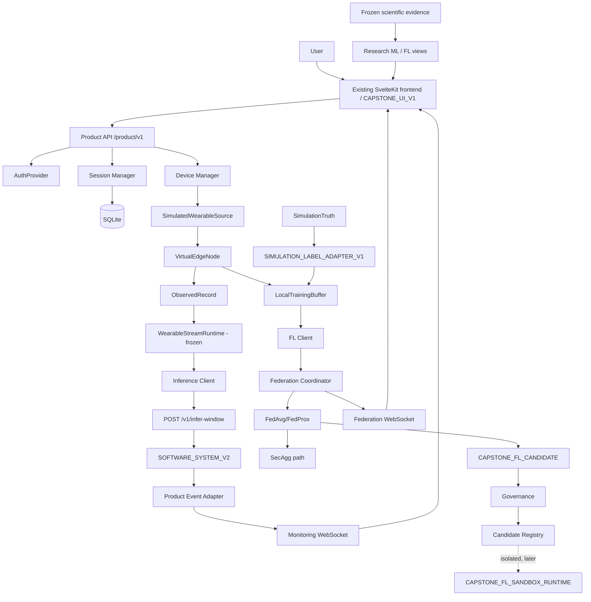

# CAP-001 architecture graph (FL-first)

**[F]** existing frozen/upstream component reused unchanged; **[C1]** interface frozen by CAP-001
(implemented in the named phase). Every arrow is a row of `contracts/capstone/connection_table_v1.json`
(edge ids in brackets).

## A. Live monitoring chain (plane 1 -> 2 -> 5 -> 1)
```
User -> Existing SvelteKit frontend [F, CAPSTONE_UI_V1 additive; M01] -> Product API [C1; M02]
  -> AuthProvider [C1; M03]      -> Session Manager [C1; M18] -> SQLite [C1; M19]
  -> Device Manager [C1; M04] -> SimulatedWearableSource [C1 interface; CAP-002; M05]
      -> VirtualEdgeNode [C1; M06] -> ObservedRecord [F; M07]
      -> existing WearableStreamRuntime [F; M08] -> Inference Client [C1; M09]
      -> POST /v1/infer-window [F; M10] -> SOFTWARE_SYSTEM_V2 [F; M11] -> InferWindowResponse [F; M12]
      -> Product Event Adapter [C1; M13, M14, M15] -> monitoring WebSocket [C1; M16]
      -> frontend monitoring UI (existing dashboard components reused) [M17]
```
Future physical hardware replaces only SimulatedWearableSource/VirtualEdgeNode.

## B. Federation chain (plane 2 -> 3 -> 4)
```
VirtualEdgeNode -> LocalTrainingBuffer [C1; F01]   <- SIMULATION_LABEL_ADAPTER_V1 [F02, F03]  (the only SimulationTruth consumer)
  -> existing/adapted FL client [F04] -> Federation Coordinator [F05]
  -> FedAvg/FedProx [F; F06] -> SecAgg path [F; F07] -> CAPSTONE_FL_CANDIDATE [F08]
  -> Model Governance [F09] -> Candidate Registry [F10]
  -> federation WebSocket [F11] -> frontend federation UI [F12];  registry -> /app/models [F13]
  -> (only if a candidate is exercised) CAPSTONE_FL_SANDBOX_RUNTIME [F14]   -- isolated, never /app/monitoring
  coordinator/candidates -> SQLite [F15]
```
The training path never feeds the live path; the live path never reads the training buffer.

## C. Scientific evidence (plane 1)
```
frozen scientific evidence -> Research ML view [S01] / Research FL view [S02] -> frontend research UI [S03]
```

## D. Mermaid


## E. Boundaries
- No edge links planes 3/4 to the released monitoring plane; MODEL_V2_FINAL stays the released default.
- Product routes live on a separate FastAPI app; `/v1/infer-window` and `API_SCHEMA_V1` are unchanged.
- No public model/candidate selector; identity never reaches the ML stack.
